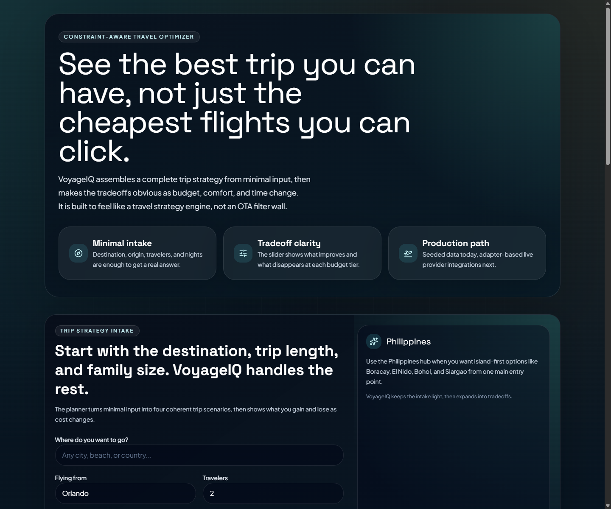
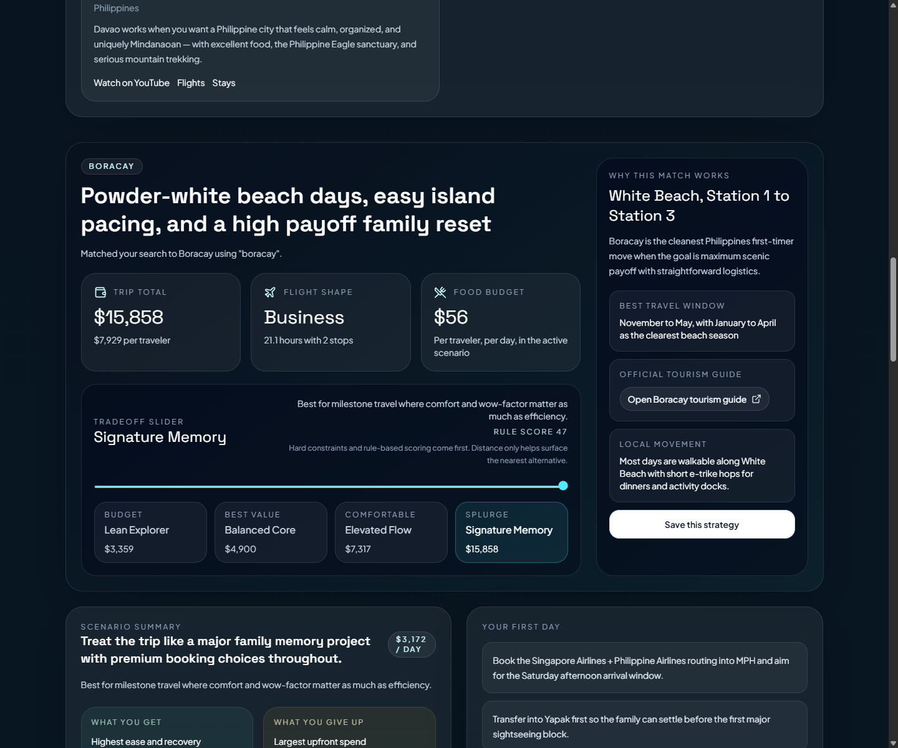

# VoyageIQ

Constraint-aware travel optimization that turns minimal input into a full trip strategy, then explains what changes as budget, comfort, and trip length move.

Live app: [voyageiq-three.vercel.app](https://voyageiq-three.vercel.app)

## Demo





## At A Glance

- Strategy-first travel planner, not a booking-filter clone
- Generates complete trip scenarios from lightweight user input
- Combines deterministic pricing with live provider enrichment
- Ships as a Vercel-ready full-stack TypeScript application
- Designed to demonstrate product thinking, system design, and clean engineering boundaries

## Why This Project Matters

VoyageIQ is intentionally not a booking-filter clone.

Most travel products make users do the assembly work:
- find a destination
- compare flights
- compare stays
- guess which meals and activities fit the budget
- manually piece together an itinerary

VoyageIQ takes a different product stance:
- ask for minimal input
- generate complete trip scenarios
- make tradeoffs legible
- keep core math deterministic and explainable
- preserve a clean path from seeded planning to live provider data

That makes it a strong portfolio project because it combines:
- product thinking
- full-stack implementation
- typed domain modeling
- adapter-based architecture
- deterministic pricing logic
- deployable production workflow

## What The App Does

- Accepts a destination, origin, traveler count, and trip length
- Generates multiple trip scenarios such as lean, balanced, elevated, and signature
- Builds detailed trip outputs with:
  - flight guidance
  - lodging strategy
  - restaurants
  - activities
  - arrival planning
  - day-by-day itinerary flow
  - total family cost, cost per traveler, and cost per day
- Shows tradeoff deltas between scenarios
- Uses a similarity helper to surface the nearest cheaper, premium, or convenience-first alternative
- Supports Philippines-specific discovery with top-spot cards and outbound travel/video links
- Uses direct place-page enrichment when Google Places data is available

## Current Engineering Highlights

- Next.js 16 App Router application deployed on Vercel
- React 19 + TypeScript with strict typing
- Deterministic scenario engine and pricing pipeline
- Hybrid travel-data architecture:
  - seeded destination intelligence for baseline planning
  - live flight enrichment path
  - live hotel enrichment path
  - live Google Places enrichment for exact place pages
- Adapter registry that keeps provider logic outside the UI
- Lightweight persistence path with Drizzle + libSQL/Turso
- Test coverage across adapters, domain logic, parsing, and planner flow

## Tech Stack


Primary libraries and services:
- Next.js
- React
- TypeScript
- Tailwind CSS
- Framer Motion
- Zod
- Drizzle ORM
- libSQL / Turso
- Vercel

External travel/provider integrations in the current codebase:
- Travelpayouts for flight enrichment
- Amadeus hotel path for lodging enrichment
- Google Places for exact place-page enrichment

## Product Architecture

VoyageIQ is organized around a few clear layers:

1. Intake layer
   Converts lightweight user input into a typed trip request.

2. Scenario engine
   Generates coherent trip options using destination seeds, business rules, and deterministic pricing.

3. Tradeoff engine
   Scores scenarios and explains what improves or disappears as the user moves across budget/comfort levels.

4. Provider/adapters layer
   Normalizes third-party travel data behind typed interfaces so live sources can evolve without rewriting the UI.

5. Verification layer
   Attaches direct flight, hotel, restaurant, and activity links to the final scenario output.

6. Persistence layer
   Saves generated plans and selected scenarios with a small-footprint database approach suitable for Vercel.

For a more detailed breakdown, see [docs/architecture.md](/C:/Users/lily7/Claude%20Code%20Projects/VoyageIQ/docs/architecture.md).

### Architecture Diagram

```mermaid
flowchart LR
    A["Minimal Input UI"] --> B["Planner Input Parsing"]
    B --> C["Destination Resolution"]
    C --> D["Scenario Generation"]
    D --> E["Deterministic Pricing + Rule Scoring"]
    E --> F["Similarity Helper"]
    F --> G["Provider Registry"]
    G --> H["Verification + Live Enrichment"]
    H --> I["Scenario Explorer UI"]
    I --> J["Saved Trips / Persistence"]
```



## Repo Structure

```text
app/          Next.js routes, pages, and API endpoints
components/   UI, planner, and result views
adapters/     External provider integrations and normalization
domain/       Core trip, pricing, and scenario logic
features/     Search parsing and scenario presentation helpers
server/       Service orchestration and repositories
drizzle/      Schema and database config
tests/        Adapter, domain, integration, and server tests
docs/         Architecture and product/design notes
```

## Local Setup

1. Install dependencies

```bash
npm install
```

2. Copy environment variables

```bash
copy .env.example .env.local
```

3. Start the app

```bash
npm run dev
```

4. Open the local site

```text
http://localhost:3000
```

## Environment Variables

Minimal local setup:

```bash
TURSO_DATABASE_URL=file:./voyageiq.db
NEXT_PUBLIC_APP_URL=http://localhost:3000
```

Optional or production integrations:

```bash
TURSO_AUTH_TOKEN=
GOOGLE_PLACES_API_KEY=
AMADEUS_CLIENT_ID=
AMADEUS_CLIENT_SECRET=
TRAVELPAYOUTS_API_TOKEN=
```

Behavior by environment:
- If live provider credentials are missing, VoyageIQ falls back to seeded planning data
- If `GOOGLE_PLACES_API_KEY` is present, exact place-page enrichment is used for lodging, dining, and activities
- If Turso credentials are present, saved trip data can persist in production across restarts

## Available Scripts

```bash
npm run dev
npm run build
npm run start
npm run lint
npm run typecheck
npm run test
npm run db:generate
npm run db:push
npm run db:studio
```

## Testing

Current tests cover:
- adapter behavior
- destination lookup
- planner input parsing
- server cache behavior
- planner integration flow

Run all tests:

```bash
npm run test
```

## Engineering Decisions Worth Calling Out

- Core cost math is deterministic, not LLM-generated
- Similarity is used as a helper, not the core planner engine
- The UI stays thin; business logic lives in domain and server modules
- Provider integrations are modular and replaceable
- The app is Vercel-friendly and avoids depending on production filesystem persistence
- User-facing outputs are traceable back to explicit scenario inputs and rules

## Engineering Challenges

### 1. Turning Travel Planning Into A Typed System

The hardest product problem was not rendering cards. It was defining a clean internal model for:
- destinations
- trip scenarios
- tradeoff changes
- cost breakdowns
- provider verification links

That modeling work lives in the domain layer and makes the app easier to extend without turning into a UI-first monolith.

### 2. Mixing Seeded Planning With Live Data

VoyageIQ is intentionally built so the planner still works when live APIs are missing or fail.

The result is a hybrid system:
- seeded destination intelligence guarantees baseline scenario generation
- live provider data enriches the final output when credentials are present
- fallbacks keep the app usable and demoable at all times

That is a more production-aware architecture than hard-depending on every external API from day one.

### 3. Making Tradeoffs Explainable

It was important that the product not feel like a black box.

Instead of a single “best” answer, the app:
- computes multiple scenarios
- scores them with explicit business logic
- uses similarity only after scoring
- explains what changes when the user moves toward cheaper or more premium options

That creates a better product story and a more defensible engineering design.

### 4. Keeping The Repo Employer-Friendly

This project was organized to be easy to review:
- domain logic is separated from UI
- external provider concerns are isolated in adapters
- orchestration lives in server services
- documentation is maintained alongside implementation

That was a deliberate engineering choice, not an afterthought.

## Roadmap

High-value next steps:
- stronger live provider coverage across more destinations
- richer family/traveler preference modeling
- more diverse itinerary day archetypes
- saved trips/history view
- better caching and rate-limit handling for provider APIs
- deeper direct-booking and mapping integrations

## Documentation

- Project operating guide: [CLAUDE.md](/C:/Users/lily7/Claude%20Code%20Projects/VoyageIQ/CLAUDE.md)
- Architecture overview: [docs/architecture.md](/C:/Users/lily7/Claude%20Code%20Projects/VoyageIQ/docs/architecture.md)
- UX/design planning notes: [docs/superpowers/specs/2026-03-15-voyageiq-ux-overhaul-design.md](/C:/Users/lily7/Claude%20Code%20Projects/VoyageIQ/docs/superpowers/specs/2026-03-15-voyageiq-ux-overhaul-design.md)

## Employer Notes

If you are reviewing this project as an employer, the strongest things to look at are:
- the separation between product logic and provider integrations
- the deterministic pricing/tradeoff architecture
- the typed domain modeling
- the quality of the Vercel deployment workflow
- the way the app moves from seeded planning to live enrichment without collapsing into a monolith

This repo is meant to show how I think as a student engineer:
- I care about product framing, not just implementation
- I use structure and documentation to keep complexity under control
- I can build something user-facing while still respecting architecture, testing, and deployment concerns
